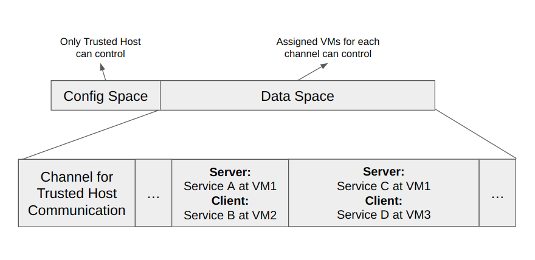
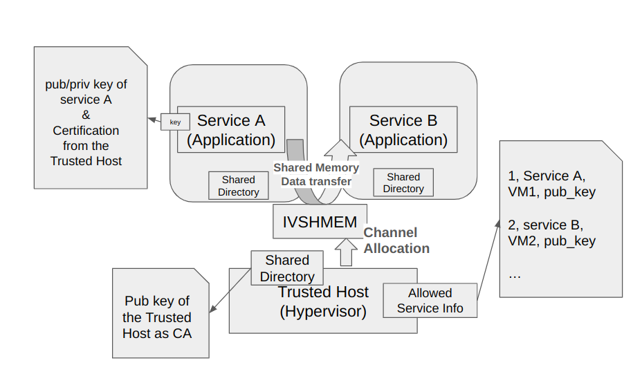
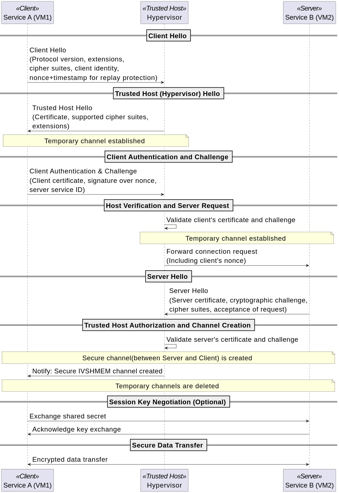

# Secure IVSHMEM IDF Proposal

## 1. Title of the invention

Secure End-to-End Channel Allocation Protocol for IVSHMEM Communication

## 2. Names of the inventors

Intel IA Korea

## 3. Resubmision Responses:

N/A

## 4. Techonlogy Background

### Introduction to Virtualization Technology
Virtualization refers to a technology that allows a single physical computing resource to run multiple isolated environments by abstracting hardware from the software. A hypervisor abstracts the underlying hardware so that multiple VMs (Virtual Machines) share the same physical resources while remaining isolated from each other.

### Virtualization in the Automotive Industry
One of the fields that virtualization is actively used is the automotive industry. The advances in semiconductors have shifted system architectures from traditional microcontrollers(MCUs) to powerful System-on-Chip(SoC). This evolution not only enhances computational capabilities but also paves the way for Software-Defined Vehicles (SDVs), where flexibility, scalability, and rapid updates are paramount. In SDVs, virtualization technology plays a crucial role by enabling the coexistence of multiple VMs on a single hardware platform, ensuring isolated yet efficient execution of diverse applications. For example, modern cockpit domain controllers often deploy separate VMs for real-time operations (RTOS) and infotainment systems, which is essential for balancing performance and safety.

### Overview of Inter-VM Communication
Building on the virtualization concept, inter-VM communication refers to the methods and protocols that allow different virtual machines to exchange data and coordinate their operations. Traditional approaches, such as TCP/UDP over a network stack or even UART-based messaging, often fall short in terms of speed and resource efficiency. Alternative solutions like VirtIO offer a para-virtualized communication mechanism through ring buffers (VirtQueues), but it still introduces overhead compared to shared memory. 

### Benefits of IVSHMEM for inter-VM Communication
On the other hand, IVSHMEM(Inter-VM Shared Memory) enables efficient communication between VMs by allocating a shared region of memory that is simultaneously accessible from multiple VMs. Because it bypasses many of the layers involved in traditional communication approaches, IVSHMEM offers lower latency and higher throughput, making it ideal for scenarios that demand rapid data exchange.

### Concurrency and Security Considerations for IVSHMEM
IVSHMEM, by design, creates a shared memory region accessible by multiple VMs, which brings significant performance benefits but also requires careful management from both concurrency and security perspective. 
Since multiple VMs can read and write to the same memory space concurrently, improper synchronization can lead to race conditions where the order of operations becomes unpredictable. This can result in data corruption or inconsistent states. Additionally, a potentially malicious VM could inadvertently or intentionally tamper with or corrupt the shared memory, affecting the stability and security of other VMs that rely on that data.

### 4.1 Problem Definition – What technical problem did you solve?

The insecure nature of IVSHMEM exposes it to various threat models such as eavesdropping, man-in-the-middle attack, and relay attacks. This risk becomes particularly significant when critical systems interact with less secure environments. For example, when a real-time operating system (RTOS) communicates with an Android-based infotainment VM, the shared memory region is vulnerable to attacks. A malicious application running within the Android environment could eavesdrop on sensitive data, alter control signals, or relay corrupted data back to the RTOS. Such compromises not only affect the confidentiality and integrity of the exchanged information but also threaten overall system stability and safety.

Beyond security concerns, IVSHMEM also requires careful concurrency management, especially in a multi-producer, multi-consumer scenario where multiple services within a VM simultaneously access shared memory for communication. Without a well-defined synchronization mechanism, race conditions can lead to data corruption, inconsistencies, and contention-related bottlenecks, ultimately degrading system performance and reliability.

Our solution addresses both security threats and concurrency challenges in IVSHMEM by introducing a structured approach that combines memory partitioning, dynamic allocation, access control mechanisms, and performance optimization.

1. Memory Partitioning for Security: 

To prevent unauthorized access, we partition the shared memory into multiple segments, ensuring that each partition is exclusively accessible to designated VMs. This prevents malicious VMs from tampering with or eavesdropping on unauthorized memory regions. However, while partitioning improves security, it also introduces a tradeoff: reduced memory availability per communication channel. For example, in a 4MB IVSHMEM region partitioned into four 1MB segments, a communication channel assigned to Service A (VM1) and Service B (VM2) is protected from interference by a malicious VM (VM3). However, the reduced memory per channel can negatively impact performance.

2. Dynamic Shared Memory Allocation:

To mitigate performance degradation caused by static partitioning, we propose a dynamic allocation mechanism that allows shared memory channels to be allocated and resized based on real-time usage. This ensures that resources are utilized efficiently without compromising security. However, dynamic partitioning introduces two major challenges:

  * Challenge 1: Secure Channel Establishment
  How can two services securely establish a communication channel without being vulnerable to spoofing attacks?

  * Challenge 2: Preventing Unauthorized Access
  How can we ensure that a malicious service within a VM does not gain unauthorized access to dynamically allocated partitions?

We propose a solution to address the above challenges as below:

1. Hypervisor-Mediated Handshake Protocol:
To establish a secure communication channel between two endpoints, we introduce a hypervisor-mediated handshake protocol that verifies service authenticity before granting access to the shared memory region. This prevents spoofing attacks and ensures that only legitimate services can communicate.

2. Granular Access Control via Kernel Module:
To enforce fine-grained access control over dynamically allocated partitions, we implement a kernel module that regulates access permissions at the memory region level. This mechanism ensures that only authorized services can read or write to allocated channels, effectively mitigating unauthorized access risks.

3. Channel Rebalancing for Performance Optimization:
To balance security and performance, we integrate a channel rebalancing mechanism that dynamically adjusts the size of shared memory channels based on real-time communication demands. This approach prevents performance degradation due to excessive partitioning while maintaining strong security guarantees.

**Abstracted Library for Seamless Integration**

To simplify IVSHMEM integration for developers, we provide an abstracted library that encapsulates security and concurrency management mechanisms. This allows customers to leverage IVSHMEM for inter-VM communication without the complexities of manual security handling, concurrency synchronization, or performance tuning.

### 4.2 Previous Solution (if any): Describe any previous solution used to solve the problem

1) Memory Segmentation and Access Control

This approach involves partitioning the shared memory into exclusive segments, ensuring that each virtual machine (VM) is limited to its designated portion. For example, in systems like SIVSHM, each worker (or VM) is granted access solely to its allocated segment. This design isolates the effects of any illegal memory access—if a VM attempts to read or write outside its segment, the impact is contained within its own memory space, often triggering a fault without affecting other VMs.

**Advantages:**

- Provides strong isolation between VMs.
- Limits the blast radius of any erroneous or malicious memory access.

**Limitations:**

- Memory buffers are statically partitioned, leading to potential underutilization of the available memory.
- Pre-allocation is required, reducing flexibility in handling dynamic memory demands.

2) Xen’s Grant Table

The Xen hypervisor introduces the concept of grant tables, where a VM explicitly grants another VM access to specific memory pages. In this model, each memory sharing action is governed by capabilities that the hypervisor enforces.

**Advantages:**

-Fine-grained control over which memory pages are shared.
- The hypervisor ensures that only the granted pages are accessible, enhancing security.

**Limitations:**

Managing grants for a large number of pages can introduce overhead.
The granularity of control, while secure, can complicate dynamic memory sharing and reallocation in more flexible communication scenarios.

3) VirtIO Network

VirtIO Network emulates a network card to facilitate communication between VMs via standard network protocols. Although it provides a way to leverage well-understood network interfaces for inter-VM communication, the emulation layer introduces performance bottlenecks.

**Advantages:**

Leverages standard networking protocols and tools.
Can integrate with existing network-based security measures.

**Limitations:**

Performance degradation due to the overhead of network emulation.
Not originally designed for high-speed, low-latency memory sharing, which is crucial for certain applications.

4) Transparent Inter-VM Shared Memory Solutions

A number of approaches have been developed to provide transparent inter-VM shared memory, such as xensocket, xenloop, and mempipe. These methods aim to make shared memory communication appear as seamless as standard network communication, abstracting away the underlying complexities.

**Advantages:**

Simplifies the programming model by providing a transparent interface for memory sharing.
Can often be integrated with existing virtualization platforms with minimal changes.

**Limitations:**

These solutions can suffer from performance inefficiencies, particularly when compared to specialized shared memory protocols.
The added abstraction layer may also introduce security vulnerabilities if not properly managed.

**References:**

[SIVSHM](https://arxiv.org/pdf/1909.10377#:~:text=both%20security%20and%20better%20throughout,exchange%20of%20eventfds%20amongst%20VMs)
[Grant Table](https://wiki.xenproject.org/wiki/Grant_Table#:~:text=Each%20domain%20has%20its%20own,operations%20on%20the%20granter%E2%80%99s%20memory)
[Xen Loop](https://dl.acm.org/doi/10.1145/1383422.1383437)
[Mempipe](https://ieeexplore.ieee.org/document/7416013)

## 5. Overview of the invention

### 5.1 Short Summary – In 1-3 sentences, describe the core of your solution

We offer a library and kernel module that secure IVSHMEM communication by isolating channels and implementing a secure handshake protocol. Additionally, we reduce performance overhead through dynamic allocation of partitioned regions.

### 5.2 Advantages – In 1-3 sentences, describe the value of the invention to Intel or to our customers.

Customers, Automotive vendors in this context, can implement high-performance IVSHMEM communication for multiple VMs on Intel SoCs with robust security measures that eliminate potential threats. This solution ensures both secure and efficient data exchange, significantly enhancing system reliability and performance.

## 6. DETECTABILITY

### 6.1 Please describe in detail how your invention is detectable in a final product.

We propose a protocol implemented with application library and kernel module
Customer/Automotive vendor can simply implement their IVSHMEM on top of our protocol which can guarantee the security and high performance

#### A. If your invention results in a specific structural feature please describe the appearance of that feature (e.g., include SEM/TEMs of actual features if available).

communication protocol
implementation
    user level library
    kernel module
    user docs

#### B. If there are visual inspection and/or reverse engineering techniques that can be used to identify the feature, please describe them.

Code is going to be opened to all customers with liscence
anyone customer can access and easily inspect this code and protocol with the restriction of liscence

#### C. If documentation such as product literature would show usage of the invention, please let us know what to look for in that regard.

## 7. DETAILS OF THE INVENTION

### 7.1 Provide details that help us fully understand your invention, including details on how you solved the technical problem, and at least one figure. You may also provide flowcharts, graphs, slides, or data to support your description. Where appropriate, please provide and explain any empirical support, such as experimental data or simulation results, that can demonstrate the viability of your invention.

### Design Detail

#### Service-based Channel Separation

Our design divides the IVSHMEM architecture into two primary sections: the **Control Section** and **the Data Section**. The Control Section is a fixed-size region where a trusted host stores dynamic configurations related to data allocation, while the Data Section is where virtual machines (VMs) actually read and write data through their assigned channels. Importantly, only the trusted host has permission to modify data in the Control Section, and each VM is restricted to reading and writing only to its designated channels within the Data Section.

The **Data Section** comprises multiple channels, with each channel serving as a dedicated buffer space for a specific server and client service pair. For each pair, a dedicated channel is allocated, and the Control Section dynamically adjusts its size based on the activation of channels.

For example, consider a scenario where Service A in VM1 needs to send data to Service B in VM2. In this case, the trusted host allocates an initial channel with a buffer size of 16 KB. The control information for this allocation is written into the Control Section, and only Service A and Service B are permitted to access the channel’s buffer. Additionally, the size of the channel buffer can be adjusted (enlarged or shrunk) based on the usage patterns between the services.

An exception to this rule is the first channel in the Data Section. This channel is of a fixed size and is exclusively used for communication between the trusted host and the VMs—for instance, during the initial handshake when a VM sends data to the trusted host. All VMs have access to this channel.

The **Control Section** maintains metadata about buffer assignments and channel usage. Its structure includes shared variables and an array of channel structures, which are described below:

- **free_start_offset** *(int)*:  
  Points to the next available space for a new buffer allocation.

- **num_active_channel** *(int)*:  
  Tracks the number of currently active channels.

- **control_lock** *(lock)*:  
  Ensures thread-safe modifications during resizing operations.

- **channels** *(array of channel structures)*:  
  Holds metadata for each communication channel.  
  - **service_id** *(int)*:  
    The service ID as notified by the hypervisor.
  - **client_process_id** *(int)*:  
    An identifier used for granular access control.
  - **server_service_id** *(int)*:  
    The identifier for the server-side service.
  - **server_process_id** *(int)*:  
    The process identifier for the server.
  - **data_address** *(pointer)*:  
    The address of the assigned channel buffer.
  - **data_size** *(size)*:  
    The size of the assigned channel buffer.

Channels utilize the metadata provided in the Control Section to read from and write to the designated buffer regions.

### Granualr Access Control

To enhance the security of the IVSHMEM framework, we propose a granular access control mechanism that restricts access to the shared memory channels on a per-application basis. This mechanism is implemented via a dedicated kernel module that operates on top of the IVSHMEM device driver.

### Kernel Module Integration

The kernel module intercepts all read and write system calls directed at the IVSHMEM device. By doing so, it validates each access request against a predefined set of policies that specify which host or VM is permitted to interact with a given channel. Notably, the module consults the IVSHMEM control section to enforce these access control rules, ensuring that only the authorized party can access the corresponding channel buffer.

### Channel-Specific Enforcement

Each channel within the Data Section is allocated to a specific pair of services (e.g., a server and a client). The kernel module uses the control section's metadata to determine channel assignments and enforces strict access control, permitting operations only on the designated channel buffers.

### Disabling Memory Mapping

For security reasons, the use of `mmap` is explicitly prohibited for the IVSHMEM device. While this may sacrifice some of the performance benefits typically associated with memory mapping, it is a necessary trade-off to prevent unauthorized access and to maintain robust security across the system.

This granular access control approach not only reinforces data isolation among different VMs and the host but also mitigates potential risks associated with unauthorized memory access, ensuring that the system's security is prioritized over marginal performance gains.

### Hypervisor Mediated Handshake Protocol

We examine why a secure handshake protocol is essential for IVSHMEM communication by identifying its potential security risks, demonstrate how our scenario differs from conventional communication protocols, and introduce our detailed proposed handshake design.

### The Need for Secure Handshake

**Mitigating Spoofing/Impersonation Risks**

Since the trusted host (e.g., dom0 in Xen, SOS in ACRN, or the host in QEMU/KVM) does not inherently know which service is associated with which endpoint, it must ensure that a malicious entity cannot impersonate a legitimate client or server. The protocol must defend against such spoofing attacks by validating the identity of each endpoint before establishing a dedicated channel.
    
**Securing Data in an Untrusted Environment**

The IVSHMEM memory space, used for key exchange and initial communication, is inherently insecure and can be monitored by potentially untrusted VMs. Encrypting sensitive data—including credentials and key exchange parameters—ensures that any eavesdropped information remains unintelligible and useless to an attacker.
    
**Robust Key Exchange Over Insecure Channels**

Although the key exchange takes place over an untrusted channel, the protocol employs strong cryptographic techniques (e.g., ephemeral Diffie-Hellman) to generate a shared secret. This secret is then used to secure all subsequent communications between the client and server, effectively mitigating the risks associated with the insecure IVSHMEM space.

The following handshake protocol leverages these principles to ensure that even in an environment where the initial contact is over an untrusted channel, the eventual communication between client and server is both authenticated and secure. This design effectively addresses the threat of impersonation or spoofing by mandating robust credential validation and encryption from the very first step of the handshake process.

## The Difference from Conventional Security Protocols

This scenario is similar to other network communication contexts—such as secure exchanges over VPNs or encrypted Wi-Fi networks—in that multiple parties must communicate over an inherently insecure channel. In our proposal, mutual authentication is implemented much like mTLS, where both the client and server prove their identities, and service-level authentication is ensured similarly to EE2E, confirming that the specific service endpoints are legitimate. These mechanisms verify credentials and secure connections, aligning with established practices in conventional protocols.

However, our proposed protocol is different from the conventional internet based security protocol in that 1) The trusted host (hypervisor) is not merely a passive participant but is responsible for allocating finite resources and establishing the communication channel  and 2) The hypervisor functions as a certification authority (CA), validating service credentials and orchestrating the creation of dedicated secure channels between clients and servers. 

The detailed handshake protocol steps are provided below, demonstrating the secure bootstrapping and key negotiation processes that lead to the establishment of a confidential IVSHMEM channel.

### Protocol Steps

<!-- handshake start -->

1. **Client Hello:**  
   - **Purpose:** Initiate the handshake and propose communication parameters.  
   - **Message Contents:**  
     - Protocol version and supported extensions.  
     - A list of supported cipher suites.  
     - Client identity details (service ID, process ID, VM ID).  
     - A nonce combined with a timestamp or sequence number for replay protection.  

2. **Trusted Host (Hypervisor) Hello:**  
   - **Purpose:** Acknowledge the client's request and provide trusted credentials.  
   - **Message Contents:**  
     - The trusted host’s certificate.  
     - Supported cipher suites (if negotiation is to be assisted).  
     - Any additional protocol extensions.  
   - **Action:** A temporary secure channel is created between the client and the trusted host.  

3. **Client Authentication and Challenge:**  
   - **Purpose:** Enable explicit mutual authentication.  
   - **Message Contents:**  
     - The client’s certificate.  
     - A cryptographic challenge (e.g., a signature over a nonce) to prove possession of the corresponding private key.  
     - The intended server’s service ID.  

4. **Host Verification and Server Request:**  
   - **Purpose:** Verify the client's credentials and initiate communication with the server.  
   - **Action:**  
     - The trusted host validates the client’s certificate and challenge.  
     - Upon successful validation, the trusted host creates a temporary channel for the server and forwards a secure connection request to the server, including the nonce.  

5. **Server Hello:**  
   - **Purpose:** Server passes its credentials and decision to accept the client’s request.  
   - **Message Contents:**  
     - The server’s certificate.  
     - A server-side cryptographic challenge (to verify the server’s private key).  
     - Its supported cipher suites.  
     - Acceptance of the client’s request.  

6. **Trusted Host Authorization and Channel Creation:**  
   - **Purpose:** Establish a secure, dedicated IVSHMEM channel for data transfer between the server and client.  
   - **Action:**  
     - The trusted host verifies the server’s certificate and the corresponding challenge.  
     - The trusted host creates a communication channel for the server and client and notifies the client.  
     - The trusted host deletes temporary channels previously established with both the client and the server.  

7. **Session Key Negotiation (Optional):**  
   - **Purpose:** Finalize the authentication process and derive session keys.  
   - **Actions:** The client and server use the provided ephemeral Diffie-Hellman values to compute a shared secret. 

9. **Session Management:**  
   - **Re-keying and Channel Teardown:**  
     - For long-lived sessions, incorporate periodic key renegotiation to limit key exposure.  
   - **Session Resumption:**  
     - Implement mechanisms (similar to TLS session tickets) for efficient session resumption without repeating the full handshake process.  

<!-- handshake end -->

\subsection{A Design for Performant Data Transfer}

\subsubsection{Dynamic Channel Rebalancing}

blah blah blah

\subsubsection{Lock-free Data Transfer}

blah blah blah

\subsubsection{Bi-directional Ring Buffer}

blah blah blah

